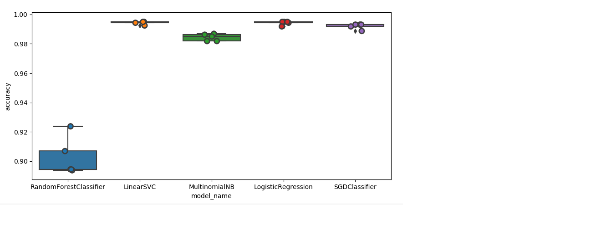

Model Performance stats
=========================

Accuracy Stats
===============
|Model|Accuracy|
|---|------|
|LinearSVC          |       0.994375|
|LogisticRegression |       0.994250|
|MultinomialNB      |       0.984375|
|RandomForestClassifier |   0.902625|
|SGDClassifier       |      0.992000|

LinearSVC  with 5 fold CV -  and classification report
======================================================
Test Accuracy 0.9925

Classification Report

| Class         |precision  |  recall | f1-score  | support|
|---------------|-----------|---------|-----------|--------|
|BICYCLES       |   1.00    |   0.99  |    1.00   |   389  |
|CONTACT LENSES |   1.00    |   0.99  |    0.99   |   419  |
|USB MEMORY     |   1.00    |   0.99  |    1.00   |   393  |
|WASHINGMACHINES|   0.97    |   1.00  |    0.99   |   399  |

Procedure to run the model
============================

1. Point PARENT_DIR in product_classifier to your folder. 
2. Run product_classifier -
	This shows the performance of various models
	and persists Linear SVC model which gave the best performance
3. Run product_classifier_api - 
	This will bring up the server and run from port 10001
4. Use make_api_request -
	This will pass in various production descriptions, for which the product category is predicted and returned in the response.
