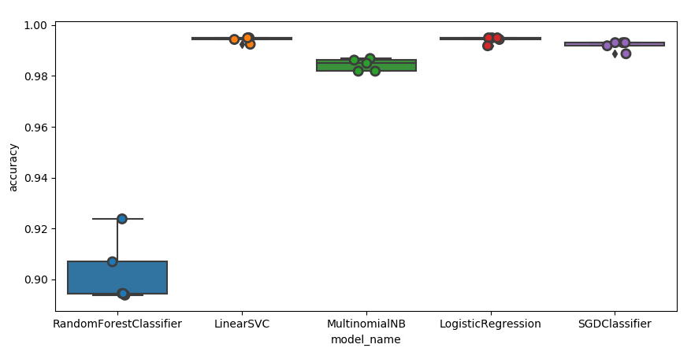

Procedure to run the model
======================

1. Point PARENT_DIR in product_classifier to your folder. 
2. Run product_classifier -
	This shows the performance of various models
	and persists Linear SVC model which gave the best performance
3. Run product_classifier_api - 
	This will bring up the server and run from port 10001
4. Use make_api_request -
	This will pass in various production descriptions, for which the product category is predicted and returned in the response.

Model Performance stats
=========================

